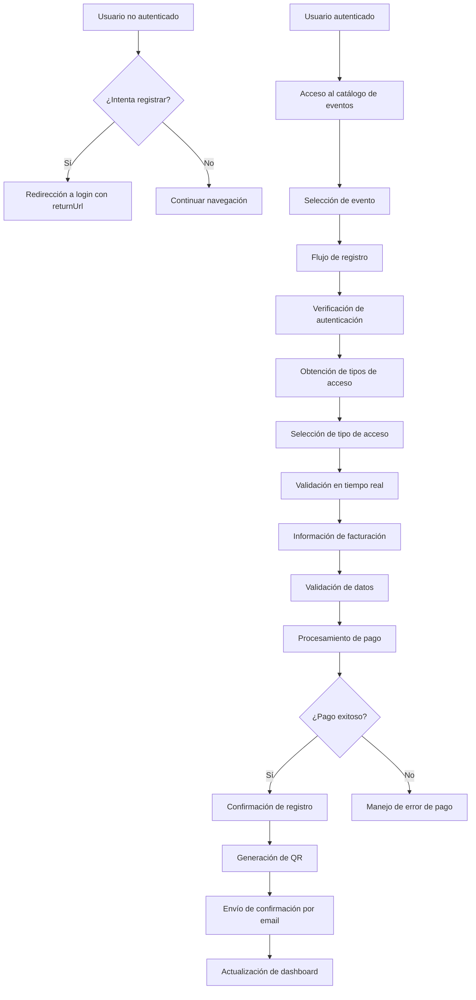
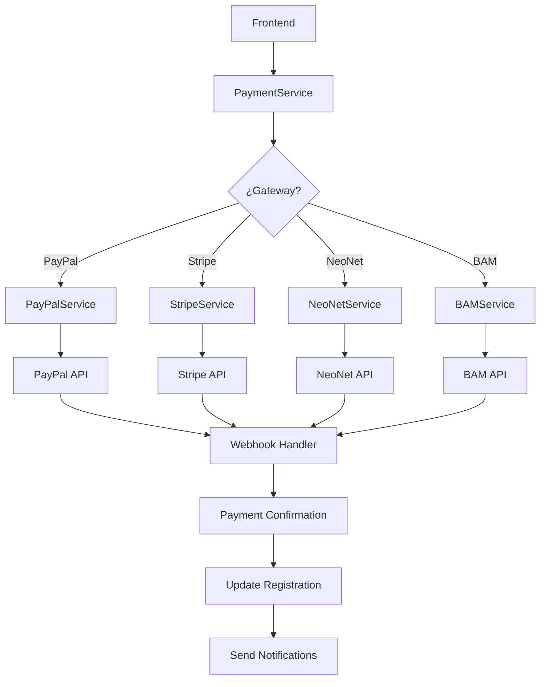
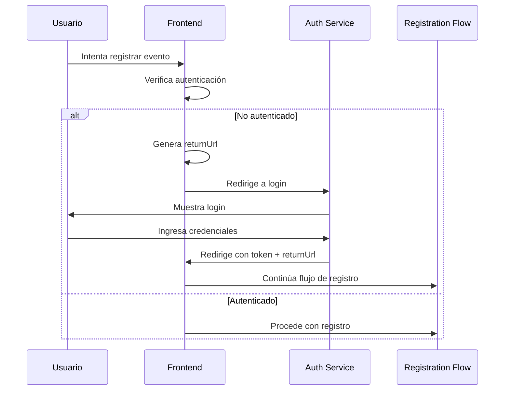

# Arquitectura del Nuevo Flujo de Registro de Eventos

## Visión General

El nuevo flujo de registro de eventos está diseñado para proporcionar una experiencia de usuario fluida y segura, eliminando dependencias de datos mock y asegurando integración completa entre frontend y backend. El sistema maneja autenticación funcional, validaciones en tiempo real, estados de pago dinámicos y redirecciones apropiadas.

## Arquitectura General



## Componentes Principales

### 1. Frontend - EventRegistrationFlow Component

#### Estados del Componente
```typescript
interface RegistrationState {
  currentStep: 'auth' | 'access' | 'billing' | 'payment' | 'confirmation';
  user: User | null;
  event: Event;
  accessTypes: AccessType[];
  selectedAccessType: AccessType | null;
  billingInfo: BillingInfo;
  paymentStatus: 'pending' | 'processing' | 'completed' | 'failed';
  validationErrors: Record<string, string>;
  loading: boolean;
  error: string | null;
}
```

#### Pasos del Flujo
1. **Verificación de Autenticación**
   - Redirección automática si no autenticado
   - Preservación del estado con returnUrl

2. **Selección de Tipo de Acceso**
   - Carga dinámica desde API
   - Validación de capacidad disponible
   - Precios dinámicos basados en configuración

3. **Información de Facturación**
   - Autocompletado desde perfil de usuario
   - Validaciones en tiempo real
   - Soporte para NIT/CUI

4. **Procesamiento de Pago**
   - Integración con múltiples gateways (PayPal, Stripe, NeoNet, BAM)
   - Estados de pago dinámicos
   - Manejo de reintentos

5. **Confirmación**
   - Generación de QR en tiempo real
   - Envío de email de confirmación
   - Actualización del dashboard

### 2. Backend - Controladores y Servicios

#### UserDashboardController
- `registerForEvent()`: Maneja registro directo (eventos gratuitos)
- `getAvailableEvents()`: Lista eventos con filtros
- `getUserRegistrations()`: Historial de registros

#### PaymentService
- `initiatePayment()`: Inicia transacción de pago
- `confirmPayment()`: Confirma pago completado
- `processRefund()`: Maneja reembolsos

#### EventRegistrationService
- `createRegistration()`: Crea registro con validaciones
- `validateCapacity()`: Verifica capacidad disponible
- `generateQR()`: Genera código QR único

#### NotificationService
- `sendRegistrationConfirmation()`: Email de confirmación
- `sendPaymentNotification()`: Notificaciones de pago

## Integración de Pagos

### Arquitectura de Pagos


### Estados de Pago
- `pending`: Pago iniciado pero no completado
- `processing`: En proceso de confirmación
- `completed`: Pago exitoso, registro confirmado
- `failed`: Pago fallido, registro cancelado
- `refunded`: Pago reembolsado

## Validaciones en Tiempo Real

### Validaciones Frontend
```typescript
const realTimeValidators = {
  email: (value: string) => {
    const regex = /^[^\s@]+@[^\s@]+\.[^\s@]+$/;
    return regex.test(value) ? null : 'Email inválido';
  },
  phone: (value: string) => {
    const regex = /^\+502\s?\d{4}[\s\-]?\d{4}$/;
    return regex.test(value.replace(/\s/g, '')) ? null : 'Teléfono inválido';
  },
  cui: (value: string) => {
    // Validación CUI Guatemala
    return value.length === 13 ? null : 'CUI debe tener 13 dígitos';
  }
};
```

### Validaciones Backend
- Verificación de capacidad de evento
- Validación de unicidad de registro
- Verificación de estado del evento
- Validación de datos de facturación

## Manejo de Errores

### Estrategias de Error Handling
1. **Errores de Validación**: Mostrar en tiempo real
2. **Errores de Red**: Reintento automático con exponential backoff
3. **Errores de Pago**: Estados específicos con opciones de recuperación
4. **Errores de Capacidad**: Mensajes claros y alternativas

### Estados de Error
```typescript
interface ErrorState {
  type: 'validation' | 'network' | 'payment' | 'capacity' | 'auth';
  message: string;
  retryable: boolean;
  action?: () => void;
}
```

## Redirecciones y Autenticación

### Flujo de Autenticación


### Preservación de Estado
- URL de retorno incluye parámetros del evento
- Estado del formulario se mantiene en localStorage
- Recuperación automática al retornar

## Notificaciones y Confirmación

### Sistema de Notificaciones
1. **Email de Confirmación**: Enviado inmediatamente después del registro exitoso
2. **Notificaciones Push**: Para actualizaciones de estado
3. **SMS**: Para eventos críticos (opcional)

### Contenido de Confirmación
- Detalles del evento
- Código QR de acceso
- Información de pago
- Instrucciones de acceso
- Enlaces a dashboard

## Seguridad

### Medidas Implementadas
- Rate limiting en endpoints de pago
- Validación de tokens JWT
- Sanitización de inputs
- Encriptación de datos sensibles
- Auditoría de todas las operaciones

## Escalabilidad

### Optimizaciones
- Caché de tipos de acceso
- Lazy loading de componentes
- Debounced validations
- WebWorkers para operaciones pesadas

## Testing Strategy

### Tipos de Tests
1. **Unit Tests**: Validaciones, utilidades
2. **Integration Tests**: Flujo completo de registro
3. **E2E Tests**: Simulación de usuario completo
4. **Payment Gateway Tests**: Mock de servicios externos

### Cobertura Requerida
- 90%+ cobertura de código
- Tests de todos los estados de error
- Tests de integración con todos los gateways

## Métricas de Éxito

### KPIs a Monitorear
- Tasa de conversión de registro
- Tasa de abandono en cada paso
- Tiempo promedio de registro
- Tasa de éxito de pagos
- Satisfacción del usuario (NPS)

## Próximos Pasos de Implementación

1. Refactorizar EventRegistrationFlow component
2. Implementar integración completa con PaymentService
3. Agregar validaciones robustas
4. Implementar manejo de errores avanzado
5. Crear sistema de redirecciones
6. Implementar estados de pago dinámicos
7. Agregar confirmación con QR y email
8. Integrar servicios de notificaciones
9. Crear suite de tests completa
10. Desplegar y monitorear